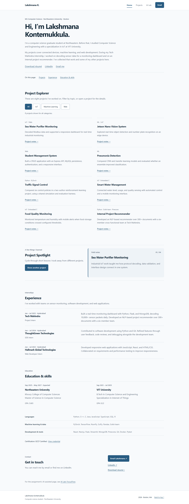
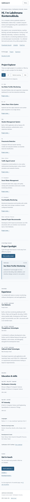
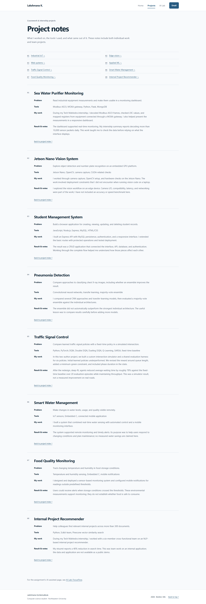
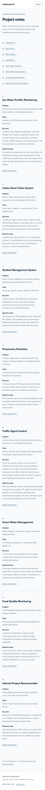
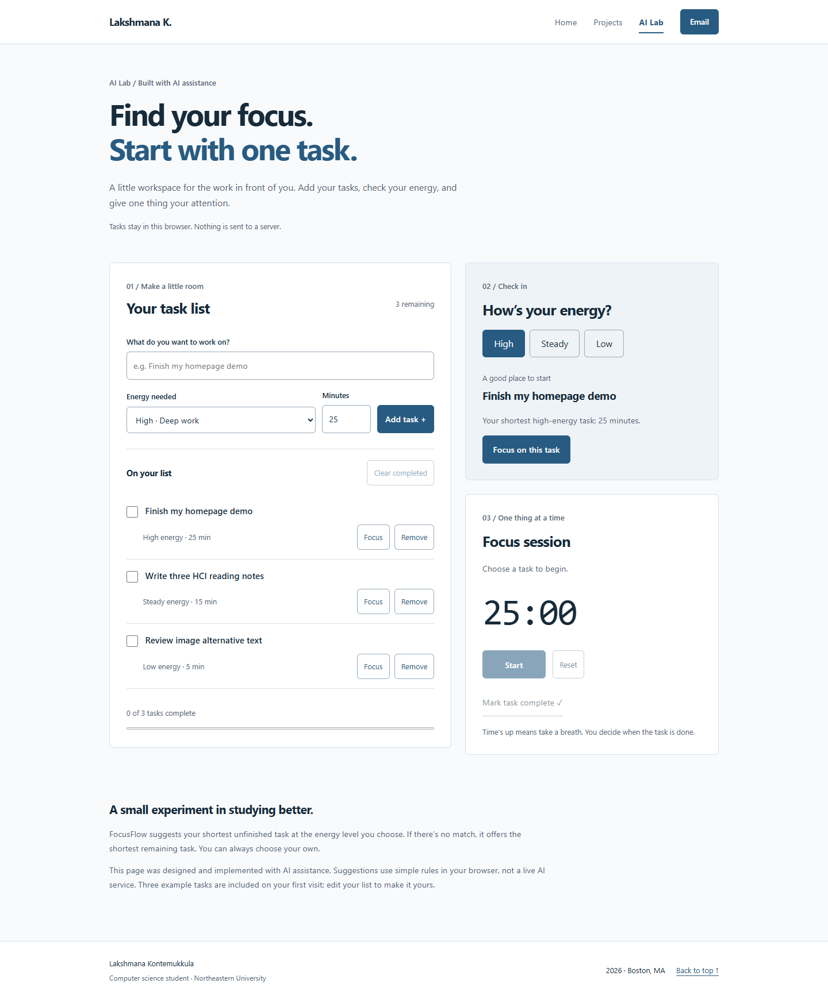
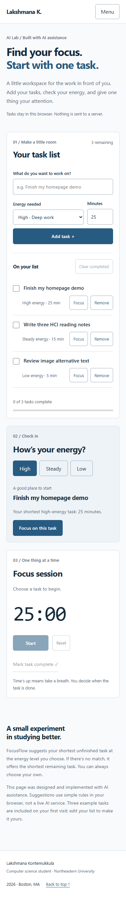

# Design Document — Lakshmana Kontemukkula Portfolio

## 1. Project Description

The project is a responsive personal homepage for Lakshmana Kontemukkula, an MS in Computer Science student at Northeastern University. The site introduces his interests in web development, machine learning, and IoT, presents representative project work, and gives visitors an interactive way to explore projects by category.

The site is intentionally implemented with vanilla HTML5, CSS3, and ES6+ modules. It does not use a back end, jQuery, Bootstrap, React, or any other component library.

### Goals

- Give a visitor a clear introduction within the first screen.
- Highlight technical interests and representative projects.
- Provide a simple, responsive experience on desktop and mobile.
- Demonstrate original JavaScript interaction using ES6+.
- Keep all three pages visually consistent while labeling the AI-assisted page clearly.
- Meet accessibility and semantic HTML expectations.

## 2. Target Users / Personas

### Persona 1 — Technical Recruiter

**Name:** Maya

**Context:** Maya is reviewing candidates for a software engineering internship. She has limited time and wants to quickly understand a student's background and strongest projects.

**Needs:**

- A short introduction that explains the student's focus.
- Scannable project descriptions.
- A simple way to move between the homepage and project details.
- A professional page that works well on a laptop or phone.

### Persona 2 — Classmate / Collaborator

**Name:** Daniel

**Context:** Daniel is another computer science student looking for a teammate for a class project. He wants to understand Lakshmana's technical interests and prior project experience.

**Needs:**

- Clear categories such as Web, ML, and IoT.
- Enough project context to identify overlapping interests.
- An easy contact option.

### Persona 3 — Instructor / Reviewer

**Name:** Professor Lee

**Context:** Professor Lee is grading the homepage assignment and needs to verify implementation requirements quickly.

**Needs:**

- Multiple working HTML pages.
- Semantic HTML and organized project files.
- Visible original functionality.
- A clearly documented AI-generated third page.
- A README that explains how the project was built and tested.

## 3. User Stories

1. **As a recruiter**, I want to understand who Lakshmana is within a few seconds so that I can decide whether to explore his work further.
2. **As a visitor interested in IoT**, I want to filter the project list to IoT projects so that I do not have to scan unrelated work.
3. **As a classmate**, I want to open a project details page so that I can understand the lessons and technologies behind a project.
4. **As a mobile visitor**, I want navigation and content to reflow cleanly so that I can use the site without horizontal scrolling.
5. **As an instructor**, I want to see an original JavaScript feature so that I can verify the student used ES6+ beyond a trivial script.
6. **As an instructor**, I want to see a separate AI-assisted page and an AI disclosure so that the use of generative AI is transparent.

## 4. Information Architecture

### Homepage (`index.html`)

- Navigation
- Personal introduction and résumé/contact links
- In-page links to projects, experience, and education
- Project Explorer
- Project Spotlight
- Internship experience
- Education, skills, and certification
- Email, LinkedIn, and résumé download
- Plain link to AI-assisted third page
- Footer

### Projects (`projects.html`)

- Navigation
- Projects introduction
- Eight project case studies, including four additions from the supplied résumé
- Link to AI-assisted page
- Footer

### AI Lab (`ai-lab.html`)

- Navigation
- Explanation that the page is AI-assisted
- FocusFlow working task planner: task form, completion list, energy suggestions, and focus timer
- Local persistence and a clear explanation of deterministic recommendations
- Footer

## 5. Design Direction

All three pages share a cool off-white background (#f8fafc), dark slate text (#172b3a),
and blue accents (#285b81). Matching system typography, heading sizes, navigation, buttons, horizontal rules,
and compact text entries make the content feel like a student's personal website.
The layout avoids slogan-led hero artwork and repeated decorative cards.

### Design decisions

- **Homepage:** a first-person introduction, eight compact filterable project entries,
  a small Spotlight notes panel, dated internships, education, skills, and contact.
- **Project notes:** an eight-link index followed by numbered articles. A definition
  list separates Problem, Tools, My work, and Result & notes. The case studies are text-only; the original image assets remain in images/.
- **AI Lab:** uses the same blue-gray palette, heading typography, navigation, footer, and buttons as the other pages. Subtle white and tinted panels organize the planner. AI assistance remains explicitly labeled in the content.
- **Responsive layout:** Grid handles project entries and case-study labels; Flexbox
  handles navigation, filters, and contact links. Narrow screens use one column.
- **Accessibility:** retained skip links, live output, keyboard focus, semantic HTML,
  reduced-motion behavior, and navigation without JavaScript.
- **CSS organization:** styles.css defines the shared visual system for all three pages; portfolio.css and focusflow.css contain page-specific layouts. Unused legacy decorative styles were removed.
- **Content and authorship:** rewriting uses existing repository claims. AI-assisted
  redesign is disclosed in README; a personal visual style is not a claim of unaided authorship.

## 6. Layout references

These captures show the revised implementation. The earlier mockup PNGs remain
in images/ as historical design assets; they are not the current layout.

### Homepage

Desktop places short project entries in two columns; mobile stacks them.
Experience and education remain text-led sections below the project interactions.

### Projects

The project index leads to eight articles with a problem/tools/work/result structure.
On mobile, labels appear above their descriptions. Concept illustration controls and images have been removed from the page.

### AI Lab: working planner

The task list and add-task form share a desktop workspace with energy suggestions and a focus timer.
At 900px the workspace stacks; at 600px the two sidebar panels stack. Earlier lab mockups remain
as historical assets. The fake score and sample progress were removed: progress reflects actual completed tasks.

## 7. Original Component

The **Project Explorer** is the primary original component. It uses buttons to filter project cards by category. JavaScript reads each card's `data-category`, toggles its visibility, updates the active filter style, counts visible projects, and updates a live text summary for accessibility.

A second JavaScript interaction, **Project Spotlight**, cycles through short project lessons without reloading the page and shows the current position. **FocusFlow** additionally manages tasks with user-specified energy and duration, recommends the
shortest matching unfinished task (or the shortest remaining task when no match exists), and runs
a start/pause/reset focus timer. Completing a timer does not mark a task done automatically.
The user checks off tasks. Task state, energy, and timer deadline persist in localStorage.
The page describes AI assistance honestly; no AI inference service runs at runtime.

## 8. Accessibility Considerations

- Semantic `header`, `nav`, `main`, `section`, `article`, and `footer` elements.
- Skip link for keyboard users.
- `aria-expanded` and `aria-controls` on the mobile navigation button.
- `aria-live` on dynamic filter and spotlight output.
- Descriptive alternative text for content images.
- Visible keyboard focus styles.
- Respect for `prefers-reduced-motion`.
- Standard `button` elements for interactive controls.

## 9. Technical Constraints

- Front-end only.
- Vanilla HTML5, CSS3, and ES6+.
- JavaScript loaded through `<script type="module">`.
- `"type": "module"` in `package.json`.
- No jQuery.
- No UI/component framework.
- CSS, JavaScript, images, and documentation in separate folders.

## 10. Redesign interaction and responsive details

- Current-page links use `aria-current="page"`; category and energy controls expose pressed states.
- Mobile navigation is progressively enhanced: links are visible without script. With script, the menu supports Escape with focus return, link selection, outside click, and breakpoint changes.
- The skip link moves keyboard focus to the main region; anchored case studies account for the sticky header.
- Content is visible before JavaScript runs. Reduced-motion preferences disable reveals and hover movement.
- Project images have explicit dimensions, useful alt text, and lazy loading below the first screen.
- At 760px homepage project entries stack and navigation switches to a menu. At 480px case-study labels stack. The FocusFlow workspace stacks at 900px and its sidebar panels at 600px.
- The original assignment constraints and project content remain in place; no achievements or performance metrics were invented.
- Screenshots and automated results are recorded in `validation-report.md`. Human review and assistive-technology testing remain valuable before submission.

## 11. Content provenance

Education, internship dates, skills, the additional four projects, and updated contact links
come from the résumé supplied on September 25. The résumé PDF is included unchanged.
The original four case studies remain from the initial assignment, even where not listed
in the newer résumé. Portfolio illustrations are conceptual diagrams, not screenshots of
those projects. Grades are shown as supplied, without inventing grading scales. The master's
completion date is explicitly marked expected. The student must verify all personal claims.

## 12. FocusFlow behavior and acceptance criteria

- Add a named task with an energy level and a whole-minute duration from 1 to 180; reject blank names.
- Complete, reopen, or remove tasks; clear completed tasks; show progress from actual task counts.
- Recommend the shortest pending task matching current energy, falling back to the shortest pending task.
- Start, pause, reset, and restart a timer. Switching to another task resets the session for that task.
- Preserve task lists (including empty lists), energy, and the selected timer across refreshes.
- Recover from invalid saved data. Explain when browser storage is blocked and operate temporarily.
- Insert task titles as text, validate loaded data, and bound the list to 100 tasks.
- Announce task actions and timer completion without announcing every second to a screen reader.
- Without JavaScript, show a clear explanation and working site navigation.
- This is local browser storage, not account storage or device synchronization. A closed browser
  cannot notify the user; elapsed timer completion is recognized when the page opens again.

